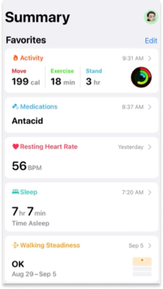
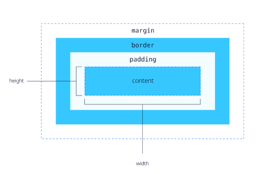
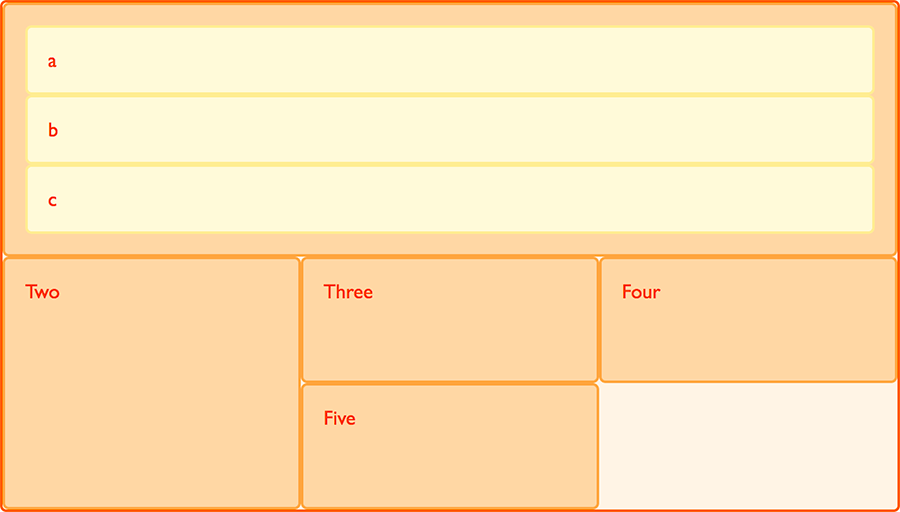

# COMP6080 WK1 Tutorial 🗺️

Joanna He

---
# Agenda

- Introductions
- Housekeeping
- HTML/CSS/JS
- Demo
- Review

--- 
## Introductions

Hi, I'm Joanna 👋🏻

- 4th year, Computer Science / Psychology @ UNSW
- I like sunsets, bouldering and travelling!
- Email: joanna.he@student.unsw.edu.au

---
## Now your turn .... 

Introduce yourself - your name, degree and second most fun fact 😎

---
## Housekeeping (1/2)

- Lectures: prerecorded (released at the start of the week) and live lectures (every Wednesday night)
- Tutorials: 1hr session to consolidate recent lecture topics (not compulsory, but highly recommended to attend)
  - Tutorial streams will be combined in week 3 onwards
- Help sessions: ~3-4 sessions held via MS Teams every week
- Assessments: four assignments in total (A1 - HTML/CSS, A2 + A3 - HTML/CSS/JS, A4 - React)

---
## Housekeeping (2/2)

Have a question and/or stuck on something? Here's where you can ask for help:
- Course forum
- Help sessions
- Course email: cs6080@cse.unsw.edu.au
- Me: joanna.he@student.unsw.edu.au

---
## Now onto frontend programming....

---
## HTML

HTML: Hypertext markup language

Defines the structure and content of a webpage

```html
<!DOCTYPE html>
<html lang="en"> 
<!-- structure of the webpage -->
<head>
    <meta charset="UTF-8">
    <meta name="viewport" content="width=device-width, initial-scale=1.0">
    <title>Document</title>
    <link rel="stylesheet" href="mystyle.css">
</head>
<!-- content of a webpage -->
<body>
    <h1>hello</h1>
    <!-- remember to include alt tags for better accessibility -->
    
</body>
</html>
```

---
## CSS

CSS: Cascading style sheets

Adds styling to a webpage

```css
body { 
    display: flex;
    flex-direction: row;
}
```
---
## Adding styling

- Inline CSS
```html
<h1 style="color:orange">hi</h1>
```

---

- Add css in the style tag of your HTML document
```html
<head>
    <!-- your head tags here... -->
    <style>
        h1 {
            /* property:  */
            color: orange;
        }

        .hi {
            color: orange;
        }
    </style>
</head>
```

---
## I don't want to use CSS in my HTML document?

- Use a separate css file and import via the link tag

```html
<!DOCTYPE html>
<html lang="en">
<head>
    <!-- other head properties... -->
    <title>Document</title>
    <!-- styles from mystyle.css will be applied to the document -->
    <style>
        /* h1 will be the colour defined in mystyle.css */
        h1 {
            color: orange;
        }
    </style>
    <link rel="stylesheet" type="text/css" href="mystyle.css">
</head>
</html>
```
---
## JavaScript

- Adds functionality to your webpage (i.e. makes your webpage dynamic)
- Will cover in more detail in next week's tutorial

---
## Demo

Let's recreate the Apple Health dashboard with HTML/CSS!

---
For bigger screen sizes (i.e. above 1000px)


---
For smaller screen sizes (i.e. below 1000px)


---

NB: All tutorial content + resources will be available at https://github.com/joanna209/tutoring

---

### Some concepts to help you style web pages a little easier...

---
## Box model

- Margin: spacing outside of the element
- Padding: spacing inside of the element



---
## Flexbox

- One-dimensional layout method for arranging items in rows or columns


---

```css
.wrapper {
    /* apply flexbox */
    display: flex;
    /* tell the element to arrange its child elements in a column format */
    flex-direction: column;
}
```

---
## Grid layout

- Two-dimensional layout method for arranging items in multiple rows and columns



---

```css
.wrapper {
    /* apply grid layout to child elements */
    display: grid;
    /* create 3 columns with a gap of 10px */
    grid-template-columns: repeat(3, 1fr);
    gap: 10px;
    /* create rows with minimum of 100px */
    grid-auto-rows: minmax(100px, auto);
}
```

---
## Media queries

- Apply CSS styling depending on the presence or value of device characteristics

```css
/* for screen sizes 200px and above, make hi attribute blue */
@media screen and (min-width: 200px) {
    .hi {
        color: blue;
    }
}
```

---
## Resources

- [MDN Web docs](https://developer.mozilla.org/en-US/) + [W3 Schools](https://www.w3schools.com/) - HTML/CSS/JS/Web dev documentation
- [Emmet](https://docs.emmet.io/cheatsheet-a5.pdf) - a cheatsheet to type HTML more efficiently

### VSCode extensions

- [HTML/CSS](https://marketplace.visualstudio.com/items?itemName=ecmel.vscode-html-css) - HTML/CSS autocomplete for VSCode
- [Live server](https://marketplace.visualstudio.com/items?itemName=ritwickdey.LiveServer) - provides hot reloading support for HTML documents