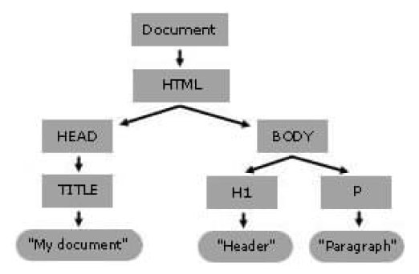

# COMP6080 WK2 Tutorial 🗺️

Joanna He

---

# Agenda

- Assignment 1 overview
- Week 1 overview
- JavaScript
- Demo
- Q&A

---

# Assignment 1 (pictocode)

is released 🎊🎉

---

## Helpful resources for Ass01

- [COMP6080 Style Guide](https://cgi.cse.unsw.edu.au/~cs6080/23T1/style/html)
- [Resources from last week's slides](https://github.com/joanna209/tutoring/blob/main/comp6080/23T3/wk01/slides.md)

---

## Any questions 👀

---

## Last week we covered...

- HTML/CSS
- Devtools and how to access it / translate output
- Flexboxes
- Box model (padding, margin, border)
- Media queries

---

## Onto JavaScript...

---

## JavaScript (JS)

Adds functionality to your webpage (i.e. makes your webpage dynamic)

---

## DOM

DOM: a data representation of the objects that comprise the structure and content of a document on the web



---

## Adding interactivity to the DOM

- We can add events to particular element id / class via event listeners
- Example: clicking a button changes the background colour of the webpage

---

## Event listeners (aka event handler)

- Event listener: a block of code that will runs when the event is "fired"
- Let's see this in action

---

```html
<button onclick="changeColor(this);">Click me</button>

<script>
function changeColor(button) {
  button.style.backgroundColor = 'red';
}
</script>
```

---

## We can one up that...

```js
// document.[instance method[event, fn]]
const button = document.getElementById("click", changeBackground);

function changeBackground() {
  // dereferencing background colour of the page
  document.body.style.backgroundColor = white;
}

// [document id].[handler]("event", "underlying js logic");
button.addEventListener("click", changeBackground);
```

---

## Common events

- `change`: an HTML element has been changed
- `click`: the user clicks an HTML element
- `mouseover`: the user moves the mouse over an HTML element
- `mouseout`: the user moves the mouse away from an HTML element
- `keydown`: the user pushes a keyboard key

https://www.w3schools.com/jsref/dom_obj_event.asp

---

## Demo

- Let's walkthrough how to make an Starbucks order form with HTML/CSS/JS

---

## Requirements

Fields required:
- Name of the peron ordering
- Location of where the person will be picking up the order from
- Order (i.e. coffee order)

Output to throw error if:
- Name is less than 3 characters or more than 50 characters
- Order is less than 3 characters or more than 50 characters

---

## Requirements (cont)

Upon successful submission, output should be parsed as 

```js
[name] has submitted an order at [curr date] for [order] for picku p at [location]
```

---

## Adding JS

- Add logic in the `<script>` tag

```html
<!DOCTYPE html>
<html lang="en">
    <!--  your head and body code -->
    <script>
        console.log('hi');
    </script>
</html>
```

---

## I don't want to use JS in my HTML document?

- Import file via script tag

```html
<!DOCTYPE html>
<html lang="en">
    <!--  your head and body code -->
    <script src="main.js"></script>
</html>
```
