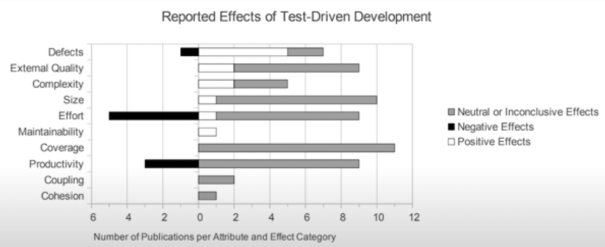

# COMP6080 WK8 Tutorial 🗺️

Joanna He

---

## Agenda

- Week 8 overview
- Test driven development
- Component testing
- UI testing
- Demo

---

## Reminder

Assignment 4 is due next Friday 10pm 😮

No late submissions are accepted

---

## Any questions?

---

## Pro tip

You can set an autocomplete to create a template JSX component via VSCode snippets, rather than writing components from scratch everytime 😄

---

```json
{
	"Create a React Functional Component boilerplate code": {
	  "prefix": "!jsx",
	  "body": [
            "import React from 'react';",
            "",
            "const ${1:${TM_FILENAME_BASE}} = ({}) => {",
            "",
            "\treturn (",
            "\t);",
            "};",
            "",
            "export default ${1:${TM_FILENAME_BASE}};",
            ""
	  ],
	  "description": "Create a React Functional Component"
	}
}
```

https://code.visualstudio.com/docs/editor/userdefinedsnippets

---

### Imagine you're in a technical interview... and they ask you to implement a dynamic time warping algorithm to measure the distance between two sequences in `O(log(n))` ...

---

## Test driven development

- Describe the behaviour of your code before implementing it
- Fail (Red) => Pass (Green) => Refactor (and the cycle continues...)



---

## Testing strategies

- Unit testing: validate behaviour of individual functions, methods or units of code (covered in COMP1531)
- Integration testing: testing multiple units of code together (e.g. component testing) 
- End to end testing: running app in simulated environment to emulate actual user behaviour (e.g. happy paths)

---

## Establishing a component 

```js
const Button = ({ onClick }) => {
  return (
    <button onClick={() => onClick()}>i am a button</button>
  );
};

export default Button;
```

---

## Writing component tests: Jest

```js
// the "describe" keyword tells us what the actual test is for
describe('button', () => {
  // the "it" keyword specifies the specific test case
  it('should say "i am a button"', () => {
    render(<Button />); // a hypothetical button
    const buttonElem = screen.getByRole("button");
    expect(buttonElem).toHaveTextContent("i am a button");
  });

  it("should call onClick once", () => {
    // jest also allows you to mock fn calls 
    const onClick = jest.fn();
    render(<Button onClick={onClick} />);
    const buttonElem = screen.getByRole("button");
    // ... and also mock user events too :D
    userEvent.click(buttonElem);
    expect(onClick).toBeCalledTimes(1);
  });
})
```

---

## But we can one up this... 🚀

```js
let btnElement;

const setup = () => {
  render(<Button />);
  buttonElem = screen.getByRole("button");
};

beforeEach(() => setup()); // before each test render the btn

describe('button', () => {
  it('should say "i am a button"', () => {
    expect(buttonElem).toHaveTextContent("i am a button");
  });
})
```

---

## Writing end to end tests: Cypress

- fun fact: is also what we used for ass2 automarking

```js
const FRONTEND_URL = "http://localhost:3000";
beforeEach(() => window.cy.visit(`${FRONTEND_URL}`)) // setup

describe('user happy path', () => {
  it('should visit home page successfully', () => {
    cy.url().should('deep.equal', `${FRONTEND_URL}/`) // check for correct url
  })

  it('should create a new request successfully', () => {
    cy.get('button[name=openrequest-modal]')
      .click()
    cy.get('input[name=request-name]')
      .type('foooooooooooo')
      .blur()
    cy.get('button[name=create-quiz-btn]')
      .click()
    cy.url().should('deep.equal', `${FRONTEND_URL}/`)
  })
})
```

---

## Rule of thumb

- The more your tests resemble the way your software is used, the more confidence they can give you
- What this means:
  - Deal with DOM nodes rather than component instances (e.g. prefer `getByRole` over `getByTestId`)
  - Test the application in the way the user would use it

---

## Demo

- Write a component test for the given login form component
- Write a happy path test containing login and dashboard user flow

---

## Next week will be the last tute 😔

Please fill in the google form if there's anything you'd like me to cover (this is anonymous btw :D)


---

## Tutorial code can be found at

https://github.com/joanna209/tutoring/tree/main/comp6080/23T3
