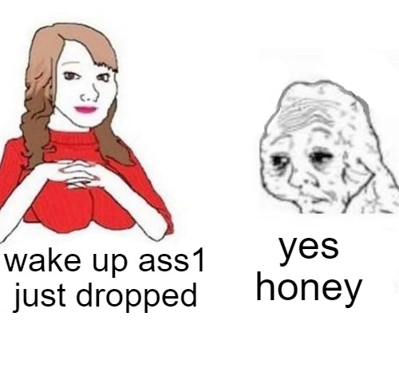

# COMP6080 WK1 Tutorial 🗺️

Joanna He

---
# Agenda

- Introductions
- Housekeeping
- Assignment 1 walkthrough
- HTML/CSS
- Demo

--- 
## Introductions

Hi, I'm Joanna 👋🏻

- 5th year, Computer Science / Psychology @ UNSW
- I like sunsets, bouldering and travelling!
- Email: joanna.he@student.unsw.edu.au

---
## Now your turn .... 

Introduce yourself - your name, degree and second most fun fact 😎

---
## Housekeeping (1/2)

- Lectures: prerecorded (released at the start of the week) and live lectures
- Tutorials: 1hr session to consolidate recent lecture topics (not compulsory, but highly recommended to attend)
- Help sessions: ~3-4 sessions held via MS Teams every week
- Assessments: four assignments in total (A1 - HTML/CSS, A2 + A3 - HTML/CSS/JS, A4 - React)

---
## Housekeeping (2/2)

Have a question and/or stuck on something? Here's where you can ask for help:
- Course forum
- Help sessions
- Course email: cs6080@cse.unsw.edu.au
- Me: joanna.he@student.unsw.edu.au

---

---

## Icebreaker activity 💀 

Split up into table groups and find 4 websites - 2 good websites and 2 bad websites.

A google doc will be sent out via email!

---
## Any questions?

All tutorial content + resources will be available at https://github.com/joanna209/tutoring
