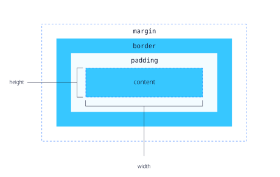

# COMP6080 WK2 Tutorial 🗺️

Joanna He

---

# Agenda

- HTML
- CSS cascade
- Box model
- Flexboxes / grid
- Media queries
- Demo

---

## Last week we covered...

- Assignment 1 tips & tricks
- Icebreakers 😊

---


## HyperText Markup Language (HTML)

- Defines the meaning and structure of web content

---

## Anatomy of a HTML tag

- Tag name
- (optional) series of attribute/value pairs
- (optional) innerHTML

```html
<span id="foo" class="css">
 <p>Text</p>
 <p>Other</p>
</span>
```

---

## Document object model (DOM)

- DOM: a data representation of the objects that comprise the structure and content of a document on the web


---


## Cascading style sheets (CSS)

- Adds styling to a webpage

---

## Anatomy of a CSS ruleset

- Selector (`<p>`): define the elements to which the rule applies
- Property (`color`): one of the style properties
- Value (`red`): One of the possible values for a given property 

```css
p {
  color: red
}
```

---

## Ok... but how do I import styling?

- Inline CSS

```html
<h1 style="color:orange">hi</h1>
```

---

## We can one up this...

- Add internal css in the style tag of your HTML document
```html
<head>
  <!-- your head tags here... -->
  <style>
    h1 { /* this changes the styles for all h1 tags */
        color: orange;
    }

    .hi {
        color: blue;
    }
  </style>
</head>
```

---

- Use a separate css file and import via the link tag

```html
<!DOCTYPE html>
<html lang="en">
<head>
  <!-- other head properties... -->
  <title>Document</title>
  <!-- apply mystyle.css styles to the document -->
  <link rel="stylesheet" type="text/css" href="mystyle.css">
</head>
</html>
```

```css
/* in mystyle.css */
h1 {
  color: orange;
}
```

---

### More on CSS rules + properties can be found at [MDN Web docs](https://developer.mozilla.org/en-US/)

---

## So.... why's my CSS property not working?


---

## CSS Cascading

https://2019.wattenberger.com/blog/css-cascade

The CSS cascade allows our browsers resolve competing CSS declarations by:
1. Importance
2. Origin
3. Specificity
4. Position

---

## Importance (1/4)

- Active animations / transitions
- Adding `!important` to the end of CSS declaration (use as last resort)
- Normal rules

```css
p {
  color: orchid !important;
}
```

---

## Origin (2/4)

- Website - where we apply CSS styling
- User
- Browser - each browser comes with its own set of styles

---

## Specificity (3/4)

The specificity of our css rules matter (with inline being most specific)

- Inline e.g. `<h1 style="colour:blue">`
- Layer (ignore this)
- Id e.g. `#id`
- Class | attribute | pseudoclass e.g. `.class`, `[checked]` or `:hover`
- type | pseudo-element e.g. `p` or `:before`

---

## Position (4/4)

- Rules that are defined later in CSS spreadsheets or `<style>` tags will be resolved first, if everything else in the cascade is the same

```css
p {
  color: sandybrown;
  color: orchid; /* the text will be orchid */
}
```

---

## Box model

- Margin: spacing outside of the element
- Padding: spacing inside of the element



---

## Flexbox

- One-dimensional layout method for arranging items in rows or columns


---
- Center elements horizontally and vertically
```css
.wrapper {
  display: flex;
  align-items: center;
  justify-content: space-around;
}
```

- Center element horizontally and vertically
```css
.wrapper {
  display: flex;
  align-items: center;
  justify-content: center;
}
```

---

## Grid layout

- Two-dimensional layout method for arranging items in multiple rows and columns


---

- Creates a 3x3 grid with 3 explicit grid columns with 1fr width and  implicit rows with 100px height

```css
.container {
  display: grid;
  grid-template-columns: repeat(3, 1fr);
  grid-auto-rows: 100px; 
  gap: 20px;
}
```

---

## Media queries

- Apply CSS only when the browser and device environment matches a rule you specify
- Often used for responsive design + dark mode implementation


---

## Anatomy of a media query

- A media type (i.e. screen)
- A media expression (i.e. `max-width`)
- A set of CSS rules

```css
@media screen and (max-width: 600px) {
  body {
    color: blue;
  }
}
```

---
## Demo

Let's recreate the Apple Health dashboard with HTML/CSS!


For bigger screen sizes (i.e. above 1000px)


---

All tutorial content + resources will be available at https://github.com/joanna209/tutoring
