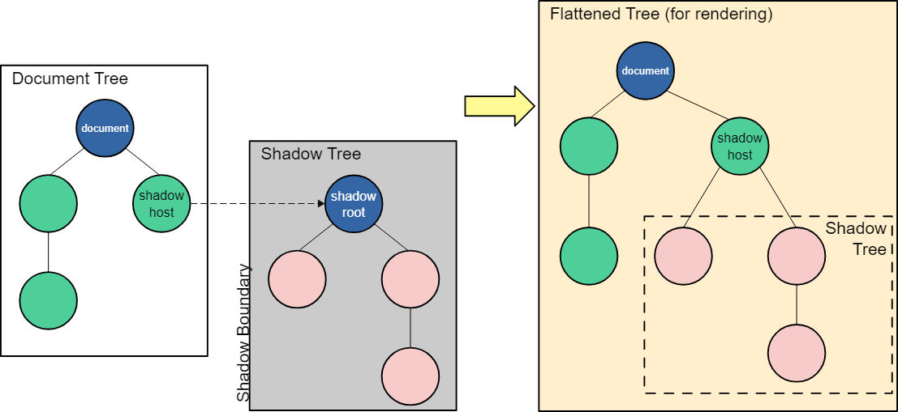

# COMP6080 WK5 Tutorial 🗺️

Joanna He

---

## Agenda

- Week 4 overview
- Assignment 3 overview
- Promises (but there's more 👀)
- HTML templates
- Demo

---

## Reminder

Assignment 3 is released and is due Week 7 Friday 10pm 🚀

No late submissions are accepted (unless with special consideration)

---

## Any questions?

---

## Last week we covered...

- Promises

---

## Onto promises...

---

```js
const doSomething = () => {
  fetch(apiUrl, {
      method: "PUT",
      headers: {
          "Content-type": "application/json",
          "Authorization": `Bearer ${userToken}`
      },
      body: JSON.stringify({
          name
      }),
  })
  .then((res) => res.json());
  .then((data) => {
      if (!data.ok) console.log("hi");
  })
  .catch((error) => console.error("hi"));
};
```

---

## I don't want to `.then()`?

- You can use `async` and `await` keywords
  - `async` - creates binding of async fn to a given name
  - `await` - wait for promise to settle in either a resolved or rejected state
- Note: `async`/`await` is **banned** in assignment 3, use `.then()`/`.catch()` instead

---

```js
// make the do something fn asynchronous
const doSomething = async () => {
  // wait for response promise to
  // settle in resolved or rejected state
  const response = await fetch(apiUrl, {
    // note: await keyword can only be used inside an async fn
    method: "PUT",
    headers: {
      "Content-type": "application/json",
      Authorization: `Bearer ${token}`,
    },
    body: JSON.stringify({
      name,
    }),
  });

  if (response.ok) {
    // resolved state
    await response.json();
    console.log("hi");
  } else {
    // rejected state
    console.error("error");
  }
};
```

---

## Previously...

---

## HTML templates????? 😮

- HTML elements where 🫵 YOU 🫵 can define its behaviour
- Usually elements are an extension of the set of elements available in the browser

---

## ⚠️ WARNING: do not use the shadow dom

(this will stop all css from cascading)

https://developer.mozilla.org/en-US/docs/Web/API/Web_components/Using_shadow_DOM

---



---

## Creating a custom element

```js
class MyCustomElement extends HTMLElement {
  static observedAttributes = ["color", "size"];

  constructor() {
    super();
  }

  connectedCallback() {
    console.log("Custom element added to page.");
  }

  disconnectedCallback() {
    console.log("Custom element removed from page.");
  }

  adoptedCallback() {
    console.log("Custom element moved to new page.");
  }

  attributeChangedCallback(name, oldValue, newValue) {
    console.log(`Attribute ${name} has changed.`);
  }
}

customElements.define("my-custom-element", MyCustomElement);
```

---

## Attaching custom elements to HTML

- Use custom name just like a in-built HTML element

```html
<my-custom-element></my-custom-element>
```

---

## Demo

Let's refactor our pokemon fetcher to use HTML templates 🔥

EXTENSION: refactor to use `async` / `await`

---

## Resources

- [MDN Web Docs](https://developer.mozilla.org/en-US/docs/Web/API/Web_components/Using_custom_elements)
- [JavaScript.info](https://javascript.info/custom-elements)

---

## Tutorial code can be found at

https://github.com/joanna209/tutoring/tree/main/cs6080/24T1
