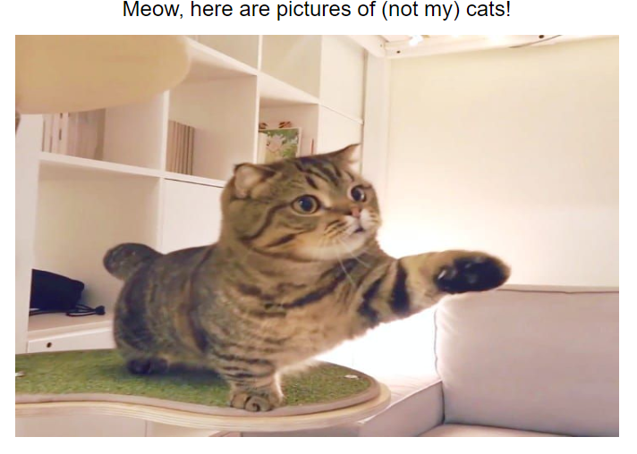
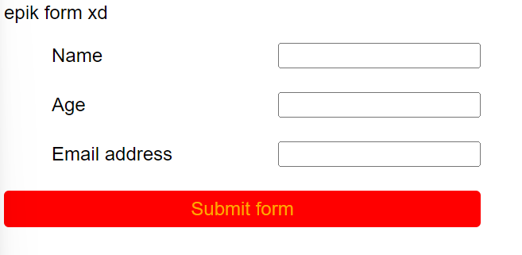
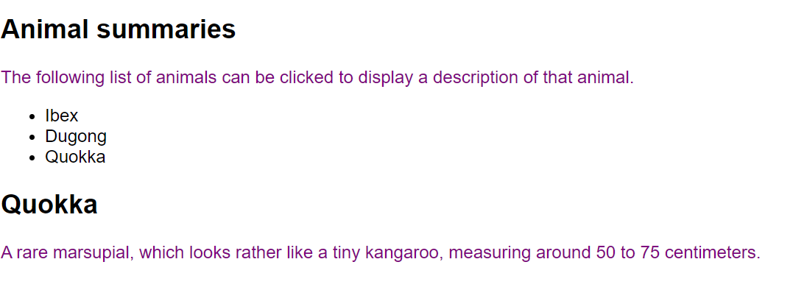

# COMP6080 WK7 Tutorial 🗺️

Joanna He

---

## Agenda

- Week 5 overview
- Assignment 4 walkthrough
- Accessibility
- Measuring accessibility
- HTML/CSS/JS best practices
- Demo

---

## Reminders (1/2)

Assignment 3 is due this Friday at 10pm 🚀

No late submissions are accepted (unless with special consideration)

---

## JUMPSCARE

---

## Reminders (2/2)

Assignment 4 has now dropped and is due WK10 Friday 19th April (time TBA)

---

## Any questions?

---

## Last week we covered...

- `async`/`await` promises
- HTML templates

---

## What is accessibility ❓❓

---

## From [MDN Web Docs](https://developer.mozilla.org/en-US/docs/Learn/Accessibility/What_is_accessibility)

Accessibility is the practice of making your websites usable by as many people as possible

---

## Benefits of accessibile design

- Having semantic HTML improves SEO
- Demonstrates good ethics & morals
- Ensures your application is usable for everyone
- Apart of the law in some places

---

## Measuring accessibility

Your application should *aim* to abide by these 4 principles from WCAG to be considered as accessible

---

| Principle  | Description |
| ------------- | ------------- |
| [Perceivable](https://developer.mozilla.org/en-US/docs/Web/Accessibility/Understanding_WCAG/Perceivable)  | Users must be able to perceive it in some way, using one or more of their senses  |
| [Operable](https://developer.mozilla.org/en-US/docs/Web/Accessibility/Understanding_WCAG/Operable)  | Users must be able to control UI elements  |
| [Understandable](https://developer.mozilla.org/en-US/docs/Web/Accessibility/Understanding_WCAG/Understandable) | The content must be understandable to its users |
| [Robust](https://developer.mozilla.org/en-US/docs/Web/Accessibility/Understanding_WCAG/Robust)  | The content must be developed using well-adopted web standards that will work across different browsers, now and in the future  |

---

## Implementing accessibility

Some ideas (not an exhaustive list):
- Use semantic HTML
- Use meaningful attributes for input and label fields
- Use meaningful alt attributes for images
- Ensure elements have adequate colour contrast

---

## Demo

Let's review some code snippets and see how we can improve the  overall accessibility of each code snippet

---

## Demo (1/3)

Refactor the starter HTML code to improve accessibility

The final result should look something like this:

---

## Demo (2/3)

Refactor the starter HTML/CSS code to improve accessibility

The final result should look something like this:

---

## Demo (3/3)

Refactor the starter HTML/CSS code to improve accessibility

The final result should look something like this:

---

## Resources

- [MDN Web Docs Accessibility guides](https://developer.mozilla.org/en-US/docs/Learn/Accessibility)
- [Designing for global accessibility (Google)](https://design.google/library/designing-global-accessibility-part-1)
- Lecture material :)

---

## Tutorial code can be found at

https://github.com/joanna209/tutoring/tree/main/cs6080/24T1
