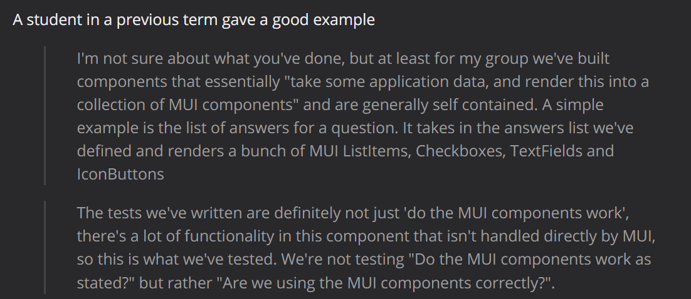
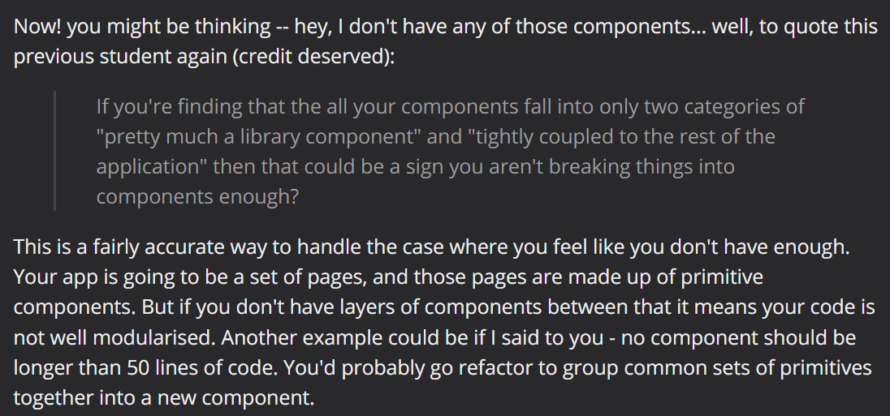

# COMP6080 WK9 Tutorial 🗺️

Joanna He

---

## Agenda

- Week 8 overview
- Component testing
- UI testing
- Demo

---

## Reminder

Assignment 4 is due WK10 Friday 10pm 😮

No late submissions are accepted

---

## Onto testing...

---

## Why care about testing?

- Allows us to understand our code and make changes w/o introducing bugs
- Improves the quality of your code immensely and the speed at which you write new code

---

## Also helps avoid situations like these... 💀

---

## Recap: blackbox vs whitebox testing (1/3) 

| Blackbox    | Whitebox |
| -------- | ------- |
| Does not have knowledge about the underlying implementation  | Does have knowledge about program's structure   |
| Test behaviour of software e.g. end user pov, output | Test code structure, conditions, paths etc    |

---

## Recap: unit testing (2/3)

- A method that allows us to test individual units of code (e.g. classes, functions)
- Cheaper to write - faster to run, takes less time to write

---

## Recap: integration testing (3/3)

- A method that allows us to test the boundaries between different components of our application
- Slower to write - faster to run, takes less time to write, prone to breaking
- But... nonetheless effective!

---

## Testing in frontend? wHERE? 😵‍💫

---

## Component testing

A form of unit testing that allows us to focus on making sure every piece of our component works perfectly in separation

---

## Component testing in ReactJS

Some options: 

- Jest/React Testing Library
- Enzyme
- Cypress

---

## An alternate perspective (1/2)

---

## An alternate perspective (2/2)

---

## UI testing

A form of integration testing that allows us to simulate how a user might interact with our web page e.g. click events, typing etc

---

## UI testing in ReactJS

Some options: 

- Cypress
- Playwright

---

## Demo

From the app we built last week, complete the following:
- Create one component test
- Create one happy path UI test

---

## Tutorial code can be found at

https://github.com/joanna209/tutoring/tree/main/comp6080/24T1

