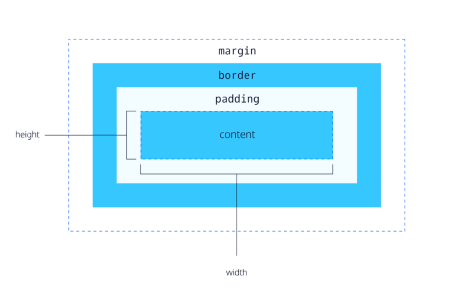
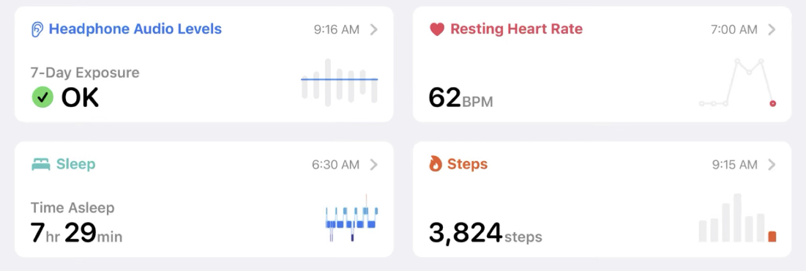

# COMP6080 WK1 Tutorial 🗺️

Joanna He

---
# Agenda

- Introductions
- Housekeeping
- Assignment 1 walkthrough
- HTML/CSS
- Demo

--- 
## Introductions

Hi, I'm Joanna 👋🏻

- 5th year, Computer Science / Psychology @ UNSW
- I like sunsets, bouldering and travelling!
- Email: joanna.he@student.unsw.edu.au

---
## Now your turn .... 

Introduce yourself - your name, degree and second most fun fact 😎

---
## Housekeeping (1/2)

- Lectures: prerecorded (released at the start of the week) and live lectures
- Tutorials: 1hr session to consolidate recent lecture topics (not compulsory, but highly recommended to attend)
- Help sessions: ~3-4 sessions held via MS Teams every week
- Assessments: four assignments in total (A1 - HTML/CSS, A2 + A3 - HTML/CSS/JS, A4 - React)

---
## Housekeeping (2/2)

Have a question and/or stuck on something? Here's where you can ask for help:
- Course forum
- Help sessions
- Course email: cs6080@cse.unsw.edu.au
- Me: joanna.he@student.unsw.edu.au

---


---

## Any questions?

---
## Now onto frontend programming....

---
## HTML

HTML: Hypertext markup language

Defines the structure and content of a webpage

```html
<!DOCTYPE html>
<html lang="en"> 
<!-- structure of the webpage -->
<head>
    <meta charset="UTF-8">
    <meta name="viewport" content="width=device-width, initial-scale=1.0">
    <title>Document</title>
    <link rel="stylesheet" href="mystyle.css">
</head>
<!-- content of a webpage -->
<body>
    <h1>hello</h1>
    <!-- remember to include alt tags for better accessibility -->
    
</body>
</html>
```

---

## CSS

CSS: Cascading style sheets

Adds styling to a webpage

```css
body { /* selector that matches the body HTML element */
    /* property: value */
    display: flex;
    flex-direction: row;
}
```

---

## Ok... but how do I add styling?

- Inline CSS

```html
<h1 style="color:orange">hi</h1>
```

---

## We can one up this...

- Add internal css in the style tag of your HTML document
```html
<head>
    <!-- your head tags here... -->
    <style>
        h1 { /* this changes the styles for all h1 tags */
            color: orange;
        }

        .hi {
            color: blue;
        }
    </style>
</head>
```

---

- Use a separate css file and import via the link tag

```html
<!DOCTYPE html>
<html lang="en">
<head>
    <!-- other head properties... -->
    <title>Document</title>
    <!-- styles from mystyle.css will be applied to the document -->
    <link rel="stylesheet" type="text/css" href="mystyle.css">
</head>
</html>
```

```css
/* in mystyle.css */
h1 {
    color: orange;
}
```

---

### More on CSS rules + properties can be found at [MDN Web docs](https://developer.mozilla.org/en-US/)

---

## So.... why's my CSS property not working?


---

## CSS Cascading

The CSS cascade allows our browsers resolve competing CSS declarations by:
1. Importance
2. Origin
3. Specificity
4. Position

---

## Importance

- Active animations / transitions
- Adding `!important` to the end of CSS declaration (use as last resort as it is limited in flexibility)
    - i.e. 
    ```css
    p {
        color: orchid !important;
    }
    ```
- Normal rules

---

## Origin

- Website - where we apply CSS styling
- User
- Browser - each browser comes with its own set of styles

---

## Specificity

The specificity of our css rules matter (with inline being most specific)

- Inline e.g. `<h1 style="colour:blue">`
- Layer (ignore this)
- Id e.g. `#id`
- Class | attribute | pseudoclass e.g. `.class`, `[checked]` or `:hover`
- type | pseudo-element e.g. `p` or `:before`

---

## Position

- Rules that are defined later in CSS spreadsheets or `<style>` tags will be resolved first, if everything else in the cascade is the same

```css
p {
  color: sandybrown;
  color: orchid; /* the text will be orchid */
}
```

---

## We can also position elements using box model

- Margin: spacing outside of the element
- Padding: spacing inside of the element



---

## Flexbox

- One-dimensional layout method for arranging items in rows or columns


---

```css
.wrapper {
    /* apply flexbox */
    display: flex;
    /* tell the element to arrange its child elements in a column format */
    flex-direction: column;
}
```

---

## Grid layout

- Two-dimensional layout method for arranging items in multiple rows and columns


---

```css
.wrapper {
    /* apply grid layout to child elements */
    display: grid;
    /* create 3 columns with a minimum size of 10px and can expand based on content */
    grid-template-columns: repeat(3, minmax(10px, 1fr));
    gap: 10px;
    /* create rows with a minimum size of 100px and can expand based on content */
    grid-auto-rows: minmax(100px, auto);
}
```

---
## Demo

Let's recreate the Apple Health dashboard with HTML/CSS!


For bigger screen sizes (i.e. above 1000px)


---

All tutorial content + resources will be available at https://github.com/joanna209/tutoring
