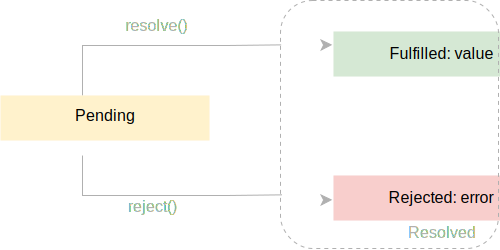

# COMP6080 WK4 Tutorial 🗺️

Joanna He

---

## Agenda

- Week 3 overview
- Promises
- Demo

--- 

## Reminder

Don't forget assignment 2 is due this Friday 10pm 😮

No late submissions are accepted (unless with special consideration)

---

## Last week we covered....

- DOM manipulation
- Event listeners
- Working with forms

---

## Onto the promises...

---

## HTTP methods

Four main methods to communicate with a server:

- `GET`
- `POST`: upload new data
- `PUT`: replace data
- `DELETE`

--- 

## How do we fetch data?

```js
function getUsers() {
  return [
    { username: 'kirby', email: 'kirby@test.com' },
    { username: 'charmander', email: 'charmander@test.com' },
  ];
}

function findUser(username) {
  const users = getUsers(); 
  const user = users.find((user) => user.username === username);
  return user;
}

console.log(findUser('kirby'));
```

---

## But API's are asynchronous...

```js
function getUsers() {
  let users = [];

  // delay 1 second (1000ms)
  setTimeout(() => {
    users = [
      { username: 'bulbasaur', email: 'bulbasaur@test.com' },
      { username: 'charmander', email: 'charmander@test.com' },
    ];
  }, 1000);

  return users;
}

function findUser(username) {
  const users = getUsers(); 
  const user = users.find((user) => user.username === username);
  return user;
}

console.log(findUser('bulbasaur'));
```

---

## We can one up this ....

```js
function getUsers(callback) {
  setTimeout(() => {
    callback([
      { username: 'baulbasaur', email: 'baulbasaur@test.com' },
      { username: 'charmander', email: 'charmander@test.com' },
    ]);
  }, 1000);
}

function findUser(username, callback) {
  getUsers((users) => {
    const user = users.find((user) => user.username == username);
    callback(user);
  });
}

findUser('baulbasaur', console.log);
```

---

## A more refined solution 👀 ... but why?

```js
function getUsers() {
  return new Promise((resolve, reject) => {
    setTimeout(() => {
      resolve([
        { username: 'bulbasaur', email: 'bulbasaur@test.com' },
        { username: 'charmander', email: 'charmander@test.com' },
      ]);
    }, 1000);
  });
}

getUsers().then((users) => {
  console.log(users.find((user) => user.username === 'bulbasaur'));
}).catch((error) => {
  console.error('Error:', error);
});
```

---

## Promises

- An object that encapsulates the result of an asynchronous operation
- Three states - pending, rejected and resolved / fulfilled
- Avoids callback hell



---

## Fetch

- Creates network requests and returns a promise

```js
fetch(apiUrl, {
  method: "GET", // by default, sends a get request
  headers: {
    'Content-type': 'application/json',
    'Authorization': `Bearer ${userToken}`
  },
  body: JSON.stringify({  // what we want to send to the api
    username: name.value,
  }),
}).then((res) => res.json()) // resolved case returns another promise
.then((data) => {
  if (!data.ok) doSomething
})
.catch(() => doSomething)  // rejected case
```

---

## Promise composition (1/2)

| Promise | Description |
| --- | --- |
| `Promise.all()` | Returns a promise that resolves if all of the promises are passed to it resolve |
| `Promise.allSettled()` | Returns a promise that resolves once all of the promises passed to it are resolved |
| `Promise.any()` | Returns a promise that resolves if at least one of the promises passed to it resolves |

---

## Promise composition (2/2)

| Promise | Description |
| --- | --- |
| `Promise.race()` | Returns a promise which resolves as soon as one of the promises passed to it resolves |
| `Promise.reject()` | Immediately return a rejected promise with a value |
| `Promise.resolve()` | Immediately return a resolved promise with a value |

---

## What is the output of this code?

```js
let promise = new Promise(function(resolve, reject) {
  resolve(1);

  setTimeout(() => resolve(2), 1000);
});

promise.then(alert);
```

---

## Solution

The output is: 1.

The second call to resolve is ignored, because only the first call of reject/resolve is taken into account. Further calls are ignored.

---

## Demo

- Let's fetch the first 20 pokemon and append the pokemon names as list tags to the DOM!

---

## Resources

- [JavaScript.info](https://javascript.info/promise-basics)
- [JavaScript Tutorial](https://www.javascripttutorial.net/es6/javascript-promises/)
- [MDN Web Docs](https://developer.mozilla.org/en-US/docs/Web/JavaScript/Reference/Global_Objects/Promise)

---

## Tutorial code can be found at 

https://github.com/joanna209/tutoring/tree/main/cs6080/24T1
