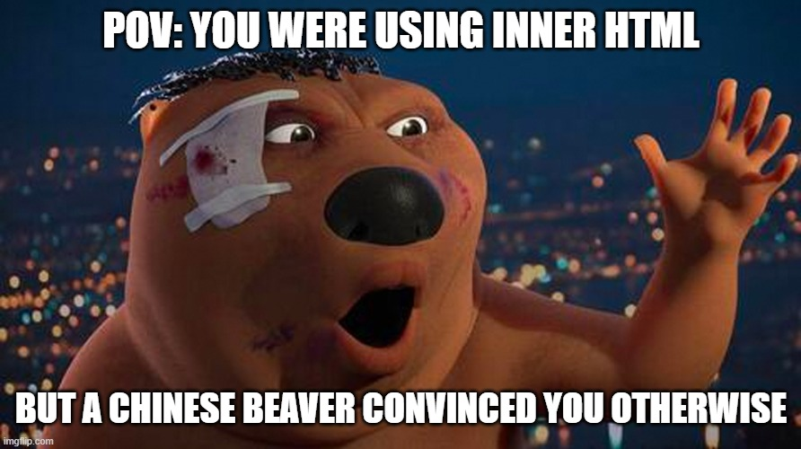
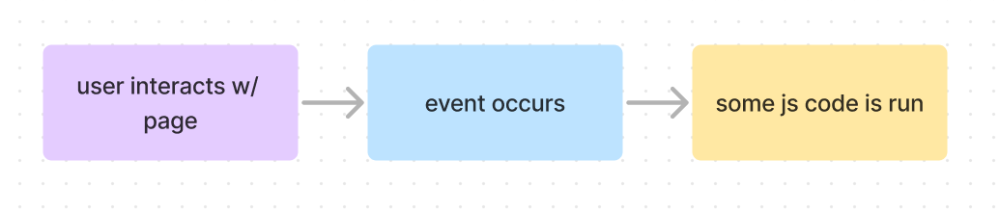

# COMP6080 WK3 Tutorial 🗺️

Joanna He

---

## Agenda

- Week 2 overview
- DOM manipulation
- Event listeners
- Working with forms
- Demo

--- 

## Reminder (1/2)

Don't forget assignment 1 is due this Friday 10pm 😮

No late submissions are accepted (unless with special consideration)

---

## Reminder (2/2)

Assignment 2 has also dropped 🚀 (due Friday 8th March 10pm)

Note: all the HTML/CSS is provided, just need to add the logic 🙂

---

## Any questions? 

---

## Last week we covered...

- HTML
- CSS cascade
- Box model
- Flexboxes / grid
- Media queries

---

## Onto JavaScript...

---


## JavaScript (JS)

Allows you to add interactivity to your website (aka on the DOM) e.g. behaviour when buttons are pressed

---

## Document object model

- A data representation of the objects that comprise the structure and content of a document on the web
- Several data types:
    - Document - represents the root of the entire DOM
    - Element - a node in the DOM tree
    - Nodelist - an array of elements

---

## Understanding DOM elements

- Element is the base class for all types of objects in the document 
- Different HTML tags/elements corrrespond to different element types in JS
- Some examples: `HTMLInputElement`, `HTMLSpanElement`, `HTMLDivElement`

---

## Selecting elements

```js
// returns an html element with the given id
document.getElementById(id);

// returns a DOM HTMLCollection of all matches
document.getElementsByName(name);
document.getElementsByTagName(name);
document.getElementsByClassName(classname);

// returns the first element that matches the selector
document.querySelector(query);
```

---

## Manipulating elements

```js
const container = document.getElementById("container");

container.innerHTML = "<button>Click me!</button>";
```

---

## We can one up this...

```js
// create a new div element
const element = document.createElement("div");
// create a new h1 tag
const button = document.createElement("button");

// make changes to attributes
button.setAttribute("disabled", "");
button.textContent = "Click me!";

// add and remove elements
element.appendChild(button);
element.removeChild(button);
```

---



---

## Manipulating styling (1/2)

- An element has a `style` property which corresponds to the `style` attribute of an HTML element

```js
// changing element background colour
element.style.backgroundColor = "red";

// changing element style
element.style.left = "50px"; // don't forget units!
```

---

## Manipulating styling (2/2)

```js
// changing element.classList
element.classList.add("class");
element.classList.remove("class");

// remove existing class or add class if it doesn't exist
element.classList.toggle("class");

// returns true if class exists on element
element.classList.contains("class");
```

---

## Events

- A signal that a thing has happened to a DOM element e.g. loading, a click or a key press
- Allows us to run JS code in response to user actions 

---

## Event examples

| Mouse events     | Keyboard events | ...and more |
| ----------- | ----------- | ----------- |
| click      | keydown       |  blur        |
|  mouseup  | keypress        |  submit      |

---

## Event handlers



---

## Adding event handlers

```js
// definition
target.addEventListener(
    type, // e.g. 'click', 'blur'
    listener, // the callback
    [options]
)
```

---

```js
const button = document.getElementById("button");

const changeBackground = () => {
  document.body.style.backgroundColor = white;
}

// add event
button.addEventListener("click", changeBackground);
// remove event
button.removeEventListener("click", changeBackground);
```

---

## Working with forms

```js
// access form elements
const form = document.forms[0]; // can also do document.forms.[form-name]
const name = form.elements['name'];
const email = form.elements['email'];

// getting element's value
let name = name.value;
let email = email.value;
```

---

## Demo

Let's walkthrough how to make an Starbucks order form with HTML/CSS/JS

---

## Requirements (1/2)

- Name of the peron ordering
- Location of where the person will be picking up the order from
- Order (i.e. coffee order)

Output to throw error if:
- Name is less than 3 characters or more than 50 characters
- Order is less than 3 characters or more than 50 characters

---

## Requirements (2/2)

Upon successful submission, output should be parsed as 

```js
[name] has submitted an order at [curr date] for [order] for pick up at [location]
```

The form should also contain a button to clear the contents of the form. 

---

## Resources

- [The Modern JavaScript Tutorial](https://javascript.info/)
- [JavaScript tutorial](https://www.javascripttutorial.net/)
- [MDN web docs](https://developer.mozilla.org/en-US/)
- [Fireship.io YT channel](https://www.youtube.com/watch?v=DHjqpvDnNGE)

---

## Tutorial code can be found at 

https://github.com/joanna209/tutoring/cs6080

