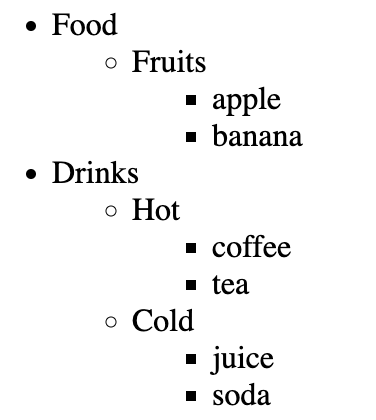

# COMP6080 WK4 Tutorial 🗺️

Joanna He

---

## Agenda

- Week 3 overview
- 
- Demo

---

## Reminder

Don't forget assignment 2 is due this Friday 10pm 😮

No late submissions are accepted (unless with special consideration)

---

## Last week we covered....

- DOM manipulation
- Event listeners
- Working with forms

---

## Creating an element


---

## Demo

Write a function `createTree` that creates a nested ul/li list from the nested object.

Each category should be interactive ie clicking on the parent `<li>` should hide/reveal its children list

---

The following nested object

```js
let data = {
  Food: {
    Fruits: {
      apple: {},
      banana: {},
    },
  },

  Drinks: {
    Hot: {
      coffee: {},
      tea: {},
    },
    Cold: {
      juice: {},
      soda: {},
    },
  },
};
```

---

The object should look something like this



---

## Resources

- [JavaScript.info](https://javascript.info/promise-basics)
- [JavaScript Tutorial](https://www.javascripttutorial.net/es6/javascript-promises/)
- [MDN Web Docs](https://developer.mozilla.org/en-US/docs/Web/JavaScript/Reference/Global_Objects/Promise)

---

## Tutorial code can be found at

https://github.com/joanna209/tutoring/tree/main/cs6080/24T1
