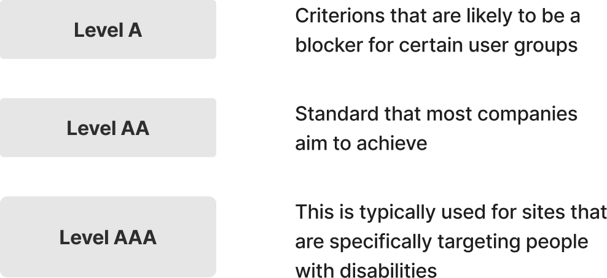
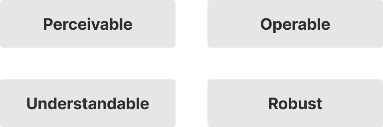
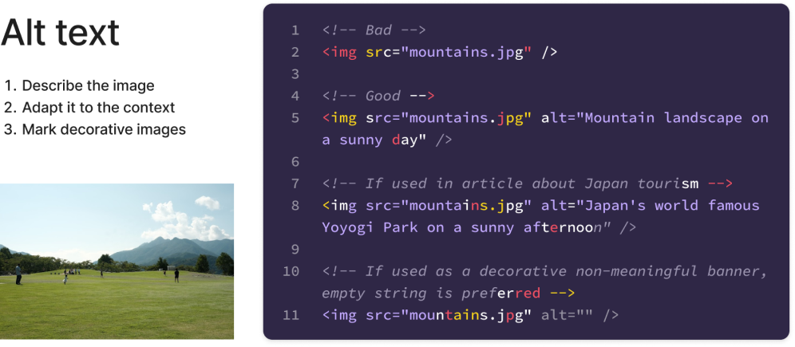
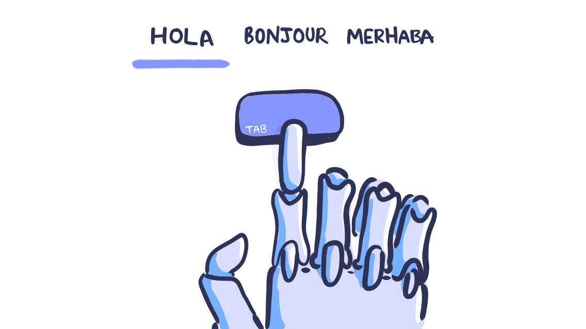
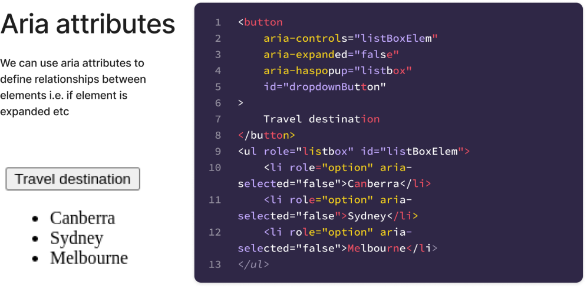
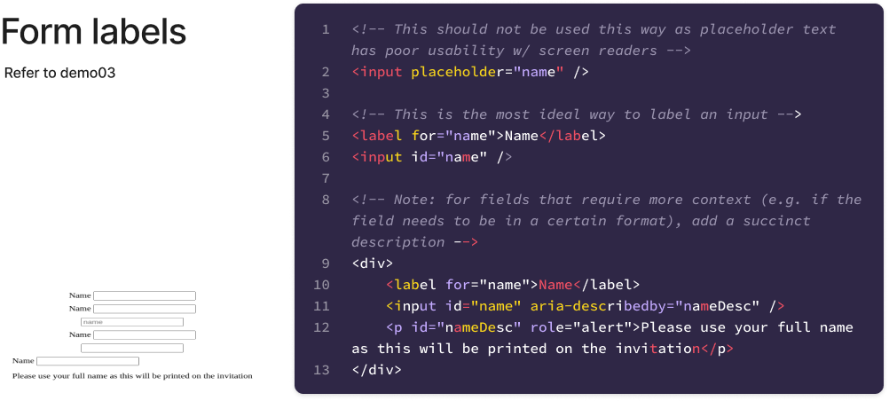
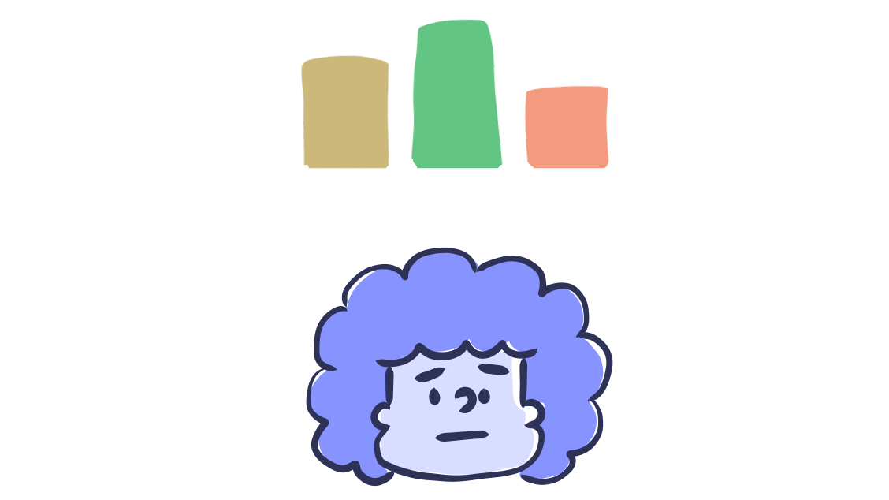
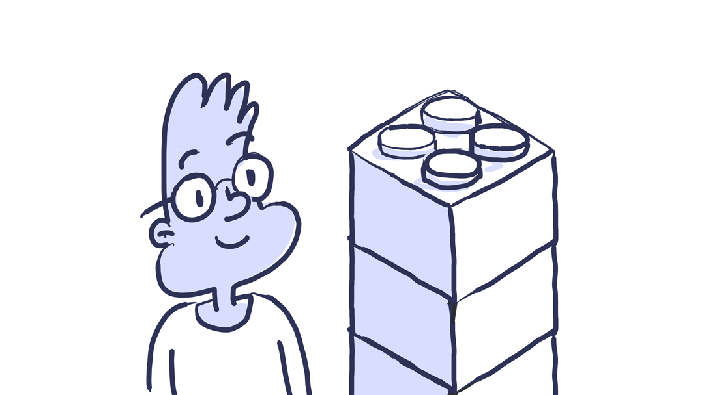

# COMP6080 WK7 Tutorial 🗺️

Joanna He

---

## Agenda

- Week 5 overview
- Accessibility
- Demo

---

## PSA (1/2)

Assignment 3 is due this Friday at 10pm 🚀

No late submissions are accepted (unless with special consideration)

---

## PSA (2/2)

Assignment 4 is now released and is due Friday WK10 at 10pm 😮

```
ℹ️ Note: make sure to fill out preference form to get access (even if working solo!) 
```

---

## Onto accessibility...

---

## What is accessibility? 🎗️

> Accessibility is the practice of making your websites usable by as many people as possible

---

## Why should we care? 🤔

---

## TDLR: building accessible sites benefits everyone

- Brings a better user experience to everyone
- Prevents legal ramifications
- Improves business outcomes

---

## Introducing WCAG

- A universal standard that codifies a series of testable, measurable statements called success criteria
- Applicable to all web technologies

---



---

## Principles of WCAG



---

## 👁️ Perceivable

Components must be presentable to users in ways they can perceive

---

## 1. Write useful alt text for non-text content

People with low vision use screen readers to "hear" the web. These tools convert text to speech so that the person can hear

```
ℹ️ Pro tip #1: describe what's happening in the picture and how it matters to the story 
```
```
ℹ️ Pro tip #2: for decorative images, use an empty alt attribute so the screen reader skips over it
```

---



---

## 2. Adding enough colour contrast

- People who have low vision will find it difficult to read text from a background colour if it has low contrast
- In practice, this means:
    - 4.5:1 contrast ratio for between text and its background
    - 3:1 contrast ratio for text 18pt or larger


```
ℹ️ Pro tip: use a colour contrast checker! 
```

---


---

## 👆🏽 Operable

Components and navigation must be operable i.e. the interface cannot require interaction that a user cannot perform 

---

## 3. Design usable focus states

Helps people with limited mobility know which element has the keyboard focus and help them understand where they are when navigating your site

```
ℹ️ Pro tip: ensure elements have visible focus indicator (e.g. links, buttons etc)
```

---



---

## 4. Support keyboard navigation

People with motor disabilities, blind people that rely on screen readers, people that don’t have precise muscle control, and even power users are dependent on a keyboard to navigate content

```
ℹ️ Pro tip #1: use ARIA attributes to improve accessibility for custom interactive elements 
```
```
ℹ️ Pro tip #2: verify all elements are in order by using the tab key to navigate and enter to select
```

---



---

## 💭 Understandable

Information and the operation of the user interface must be understandable i.e. the content or operation cannot be beyond their understanding

---

## 5. Use labels or instructions with form fields and inputs

People who use screen readers usually navigate through a form using the Tab key to jump through the form controls. Any non-label text, as placeholder text, is usually skipped over

```
ℹ️ Pro tip: avoid using placeholder text as labels, instead use <label>
```

---



---

## 6. Don't use colour alone to make critical information understandable

People with low acuity or colour blindness will have a hard time understanding your content

```
ℹ️ Pro tip #1: use an indicator other than colour e.g. text labels, icons or patterns
```
```
ℹ️ Pro tip #2: use a blindness simulator app to see how your site appears to people with vision impairments
```

---



---

## ⚙️ Robust

Content must be robust enough that it can be interpreted reliably by a wide variety of user agents including assistive technologies

---

## 7. Use the correct markup on your content

Using semantic HTML elements is crucial as they form the accessibility tree that enables screen readers to interpret and present content to blind users

```
ℹ️ Pro tip #1: avoid using HTML tags for style effect only (e.g. <strong>, <b>)
```
```
ℹ️ Pro tip #2: use appropriate heading tags to help readers understand content order
```

---



---

## Beyond these guidelines 🙌🏾

- Use screen readers to validate UI
    - Apple: voiceover
    - Chrome: screen reader
    - Android: talkback
- Use accessibility auditors (e.g. lighthouse)

---

## Some food for thought...

- Is it ever acceptable for companies to advertise accessibility as a unique feature, or should it be a standard expectation in all products?
- Can we consider a website truly accessible if it only caters to certain types of disabilities but not others?
- Should companies be held accountable for prioritising aesthetics or innovation over full accessibility in their products?

---

## Resources

- [Web Accessibility Guidelines](https://www.w3.org/TR/WCAG20/)
- [MDN Accessibility](https://developer.mozilla.org/en-US/docs/Web/Accessibility)
- [Designing for accessibility is not that hard](https://uxdesign.cc/designing-for-accessibility-is-not-that-hard-c04cc4779d94)
- COMP6080 lecture slides

---

## Tutorial code can be found at 

https://github.com/joanna209/tutoring/tree/main/cs6080/24T3
